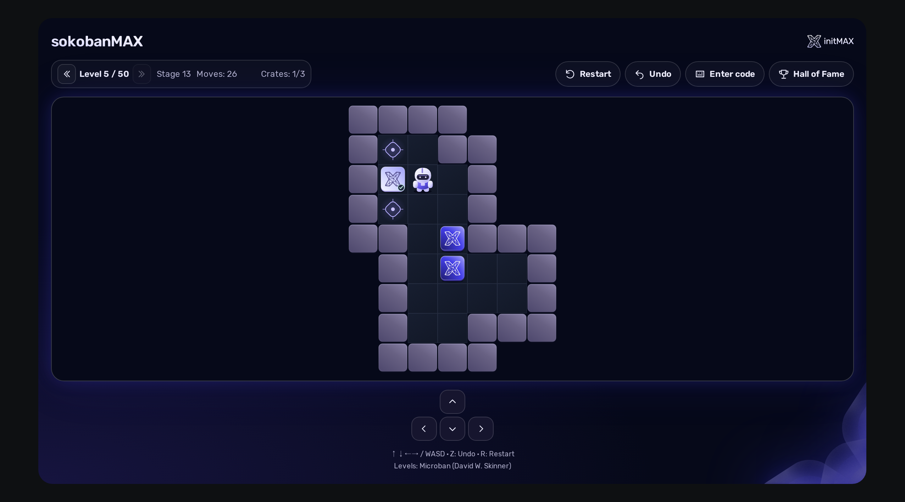
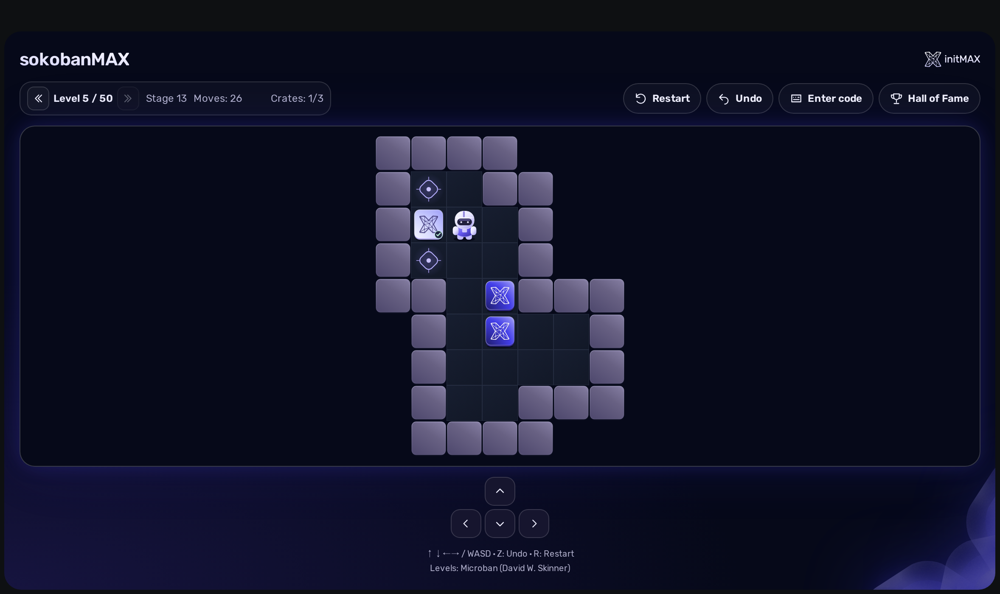
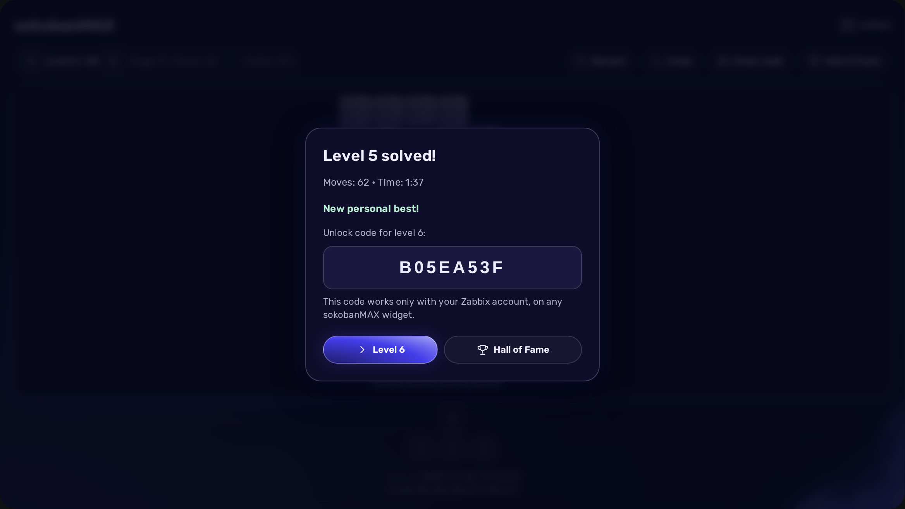
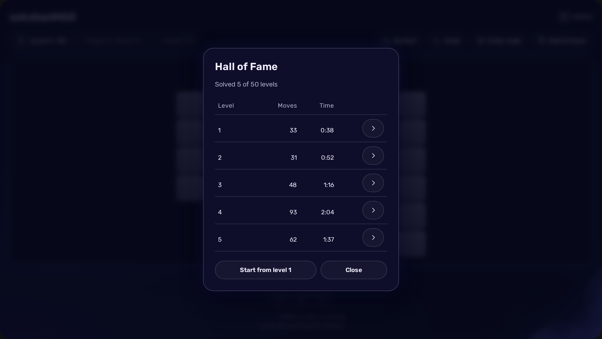
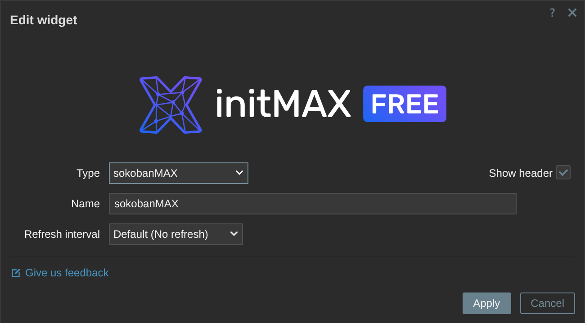

<h1>sokobanMAX</h1>

developed and maintained by

and community

<strong>The classic Sokoban puzzle, on a Zabbix dashboard.</strong> 
Push every box onto a target, level after level - somewhere for your eyes to rest between two incidents, with the server keeping score.

<a href="#what-you-can-build"><strong>Features</strong></a> &nbsp;·&nbsp;
<a href="#examples"><strong>Examples</strong></a> &nbsp;·&nbsp;
<a href="#install"><strong>Install</strong></a> &nbsp;·&nbsp;
<a href="#what-you-get"><strong>What you get</strong></a> &nbsp;·&nbsp;
<a href="#levels"><strong>Levels</strong></a> &nbsp;·&nbsp;
<a href="https://portal.initmax.com/catalog/zabbix-sokobanmax"><strong>Portal</strong></a> &nbsp;·&nbsp;
<a href="https://www.initmax.com/wiki/sokobanmax/"><strong>Docs</strong></a>

 

---

## Why sokobanMAX

A monitoring dashboard is a place people stare at all day, and the good days are the quiet ones. **sokobanMAX** gives one tile of it something to do with those minutes: a real Sokoban, played with the arrow keys, that remembers where you got to and refuses to believe a level is solved until it has replayed your moves itself.

## What you can build

<table>
<tr>
<td width="50%" valign="top">

**A break that stays on the board**
No second tab and nothing installed on the workstation - the game is a widget like any other.

</td>
<td width="50%" valign="top">

**50 levels in order**
Each one opens when you finish the one before it, and every single one is proven solvable.

</td>
</tr>
<tr>
<td width="50%" valign="top">

**A personal record**
Your best moves and best time on every level, kept in the Zabbix database - not in the browser.

</td>
<td width="50%" valign="top">

**A wall-mounted board**
On-screen arrows for touch screens and for the TV in the corner that has no keyboard.

</td>
</tr>
</table>

Unlock codes work only for the Zabbix account that earned them, across widgets on the same installation. After 10 incorrect attempts, code entry is temporarily blocked until the one-minute window expires. The server verifies legal moves and completion before recording a result.

## Examples

<table>
<tr>
<td width="33%" align="center" valign="top"> <small><b>Play</b> - arrow keys or the on-screen pad</small></td>
<td width="33%" align="center" valign="top"> <small><b>Solved</b> - the server checked the moves and opened the next level</small></td>
<td width="33%" align="center" valign="top"> <small><b>Hall of Fame</b> - your own best on every level, kept across sessions</small></td>
</tr>
</table>

## Configuration

The widget uses the standard Zabbix name and refresh settings; there are no additional game settings. Choose levels and control the game directly on the board. The interface follows your Zabbix language and keeps its navy and violet design in every dashboard theme.

Your unfinished game, move history and elapsed attempt time are saved to your Zabbix profile separately for each widget. Progress saves automatically in the background, so you can continue in another browser. An error notice with a retry action appears if saving fails. Time is measured by the server and includes breaks and time with the page closed. Restart resets only the current level and its timer. To clear this widget's saved game and your personal records, open Hall of Fame and choose "Start from level 1", then confirm. Other users and widgets keep their progress. If another window changes the same game, reload before continuing.

Unusually fast input triggers a “Please don’t cheat” warning. The flagged attempt cannot set a record or unlock the next level, even after reloading; Restart starts a fresh attempt. This is an input-speed safeguard, not proof of cheating. Existing records are not judged retroactively.

## Install

sokobanMAX builds into the same GPG-signed `deb` / `rpm` package as every initMAX widget, and **one package covers Zabbix 6.0 to 7.4**: it carries both module trees, the installer picks the one your frontend can load, and an in-place Zabbix upgrade keeps working without a reinstall.

**Easiest way - the guided installer on the Portal:** **[portal.initmax.com/catalog/zabbix-sokobanmax](https://portal.initmax.com/catalog/zabbix-sokobanmax#how-to-install)** shows the exact commands for your operating system.

**Coming from the older Sokoban widget?** Nothing to do. The package removes the old module, and the first time someone signs in, every `Sokoban` widget already on your dashboards becomes a sokobanMAX widget in place - same dashboard, same position.

Then enable it in **Administration → General → Modules**.

## What you get

| Feature                                                    |  FREE  |
| ---------------------------------------------------------- | :----: |
| 50 levels, each one proven solvable                        |   ✅   |
| The server replays every finished level before it counts   |   ✅   |
| Personal unlock codes signed with the installation's own key        |   ✅   |
| Personal best per level, kept in the Zabbix database       |   ✅   |
| Resume unfinished games across browsers                    |   ✅   |
| Reset your progress independently of other users            |   ✅   |
| Keyboard and on-screen controls                            |   ✅   |
| Zabbix 6.0 - 7.4 from one package                          |   ✅   |
| Localised into all 27 Zabbix display languages             |   ✅   |
| High availability ready                                    |   ✅   |
| Licence                                                    | AGPLv3 |

There is no paid edition. sokobanMAX is a game initMAX gives away, and everything it does is in the FREE package.

## Levels

The 50 levels are taken from **Microban by David W. Skinner** (155 puzzles, revised April 2000) - small boards, each built around one idea, which is exactly what fits a dashboard tile. They are spread evenly over his set and kept in his order, so the game starts gently and ends demanding. They are his work, not initMAX's, and are included under the terms he set for them: *"These sets may be freely distributed provided they remain properly credited."* Copyright David W. Skinner; the AGPLv3 licence of the widget does not extend to them.

Every level is documented in the project's `docs/levels` - its map, its coordinates and a screenshot - in the author's order. Eight puzzles of the set can never be selected: three are larger than a dashboard tile can show, and five are marked by the author himself as reworkings of levels from commercial games.

Every shipped level carries a stored solution that the test suite replays on every merge request, so a level nobody can finish cannot reach a release.

## Requirements

|              |                                                              |
| ------------ | ------------------------------------------------------------ |
| **Zabbix**   | 6.0 · 6.2 · 6.4 · 7.0 · 7.2 · 7.4 - one package covers all    |
| **PHP**      | 7.4 or newer                                                 |
| **OS**       | Debian/Ubuntu · RHEL/Rocky/Alma/Oracle/Amazon · SUSE         |
| **Editions** | FREE only - there is no PRO edition                          |
| **Languages** | All 27 Zabbix display languages - the widget follows each user's own language setting |
| **High availability** | Ready. Saved games and records live in the shared Zabbix database. Install the widget on every frontend node; no separate game server is needed |

## Support and links

- **[support@initmax.com](mailto:support@initmax.com)** - questions and bug reports
- **[initMAX Portal](https://portal.initmax.com/catalog/zabbix-sokobanmax)** - packages and guided installation
- **[sokobanMAX documentation](https://www.initmax.com/wiki/sokobanmax/)** - installation, how to play, how records and codes work
- **[sokobanMAX product page](https://www.initmax.com/product/sokobanmax/)** - features and FREE download
- Source code (AGPLv3) - included in every package and published as a [source archive](https://repo.initmax.com/zabbix/free/zip/sokobanmax/) on repo.initmax.com
- Levels: Microban, copyright David W. Skinner, freely distributed with credit

---

FREE: <a href="https://www.gnu.org/licenses/agpl-3.0.html">AGPLv3</a> &nbsp;·&nbsp; (c) 2021-2026 initMAX s.r.o.

